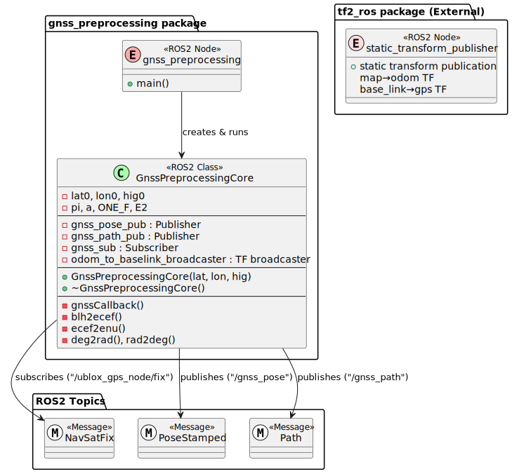

# gnss_preprocessing_node

## 1. ノード概要

### 役割・目的
- GNSSデータをリアルタイムに受信し、GPS座標系（緯度・経度・高度）をローカル座標系（ENU座標系）に変換する。
- TF（Transform）を使用して、座標系間（map→odom、base_link→gps）の静的な関係を定義・公開する。（ノードの機能ではないので，どこに記載すべきか議論）

---

## 2. 入出力設計

### 入力（Subscribe）

<!--
| 入力元ノード名 | トピック名 | 型 | 説明 |
|---|---|---|---|
| GNSSセンサーノード | `/ublox_gps_node/fix` | `sensor_msgs::msg::NavSatFix` | GNSSから取得した緯度・経度・高度情報 |
-->

| トピック名 | 型 | 説明 |
|---|---|---|
|  `/ublox_gps_node/fix` | `sensor_msgs::msg::NavSatFix` | GNSSから取得した緯度・経度・高度情報 |

### 出力（Publish）
<!---
| 出力先ノード名 | トピック名 | 型 | 説明 |
|---|---|---|---|
| 自己位置推定等 | `/gnss_pose` | `geometry_msgs::msg::PoseStamped` | ENU座標系へ変換された現在位置 |
| 経路生成・可視化等 | `/gnss_path` | `nav_msgs::msg::Path` | GNSSベースの移動経路 |
--->

| トピック名 | 型 | 説明 |
|---|---|---|
|  `/gnss_pose` | `geometry_msgs::msg::PoseStamped` | ENU座標系へ変換された現在位置 |
|  `/gnss_path` | `nav_msgs::msg::Path` | GNSSベースの移動経路，全経路 |

### 座標変換（TF）

※必ず必要

| 親フレーム | 子フレーム | 説明 |
|---|---|---|
| `map` | `odom` | 固定された地図座標系からロボットが移動する座標系への静的変換 |
| `base_link` | `gps` | ロボット本体座標系からGNSSセンサー搭載位置への静的変換 |

---

## 3. 処理フロー

---

## 4. ノード起動設定（launchファイル解説）

このセクションは不要かもしれない．少なくともlaunchファイルの解説は不要．
いろいろな使われ方をするはずなので

- `package`：ROS2パッケージ `gnss_preprocessing`
- `executable`：実行するバイナリファイル (`gnss_preprocessing`)
- `name`：ノード名（`gnss_preprocessing`としてROS2に登録）
- `output`：ノードのログをターミナル画面に出力（デバッグ容易化）

### 静的TF設定

- `tf2_ros`のstatic_transform_publisherを用いて、座標系間の静的な関係を定義する。

---

## 5. クラス設計（PlantUMLによる詳細クラス図）

---

## 6. 起動時の処理概要

1. ROS2ノードとして初期化される（初期座標は引数またはハードコードで指定）。
2. Subscriberで`/ublox_gps_node/fix`を受信待機。
3. GNSSデータ受信毎に以下を処理:
   - BLH→ECEF→ENU座標変換を実施。
   - 変換した位置情報を`PoseStamped`としてPublish。
   - 軌跡情報として`Path`へ記録・Publish。

---
